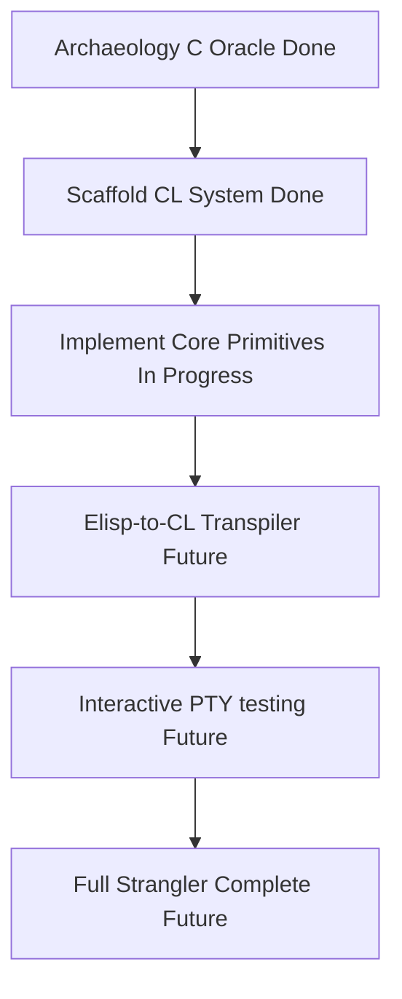

# Project Holomacs: Common Lisp Emacs Port

## Vision
To create a "Hollowed-out Emacs" (Holomacs) where the internal C core is replaced by a pure Common Lisp (SBCL) engine, while preserving the exact behavioral "hologram" of historical Emacs versions (specifically starting with GNU Emacs from 1991).

---

## What Has Been Done

### 1. Reconstructing the 1991 C Oracle (Archaeology Phase)
We successfully built a 64-bit compatible `emacs_oracle` binary from the original 1991 source code. To make it work on modern systems, we resolved:
*   **64-bit Top-Bit Tagging**: Configured the type tagging scheme to use 8-bit types (`GCTYPEBITS 8`, `VALBITS 55`) to fit the type tag of `Lisp_Window` (20) which overflows a 4-bit representation. The bottom 55 bits are reserved for pointers, matching modern x86-64 userspace addresses.
*   **Memory Corruption & Buffer Alignment**: Fixed BSS offset copy boundaries in `buffer.c` by ensuring loops increment by `sizeof(Lisp_Object)` (8 bytes) instead of hardcoded `sizeof(int)` (4 bytes), avoiding memory corruption of neighboring variables like `Vbuffer_alist`.
*   **ABI Spilling Mismatch**: Defined `NO_ARG_ARRAY` in `config.h` to ensure arguments passed to register-based C functions are correctly and contiguously stored on the stack before address-of (`&`) extraction (preventing crashes in `nconc2`/`Fnconc`).

### 2. Scaffolded Common Lisp (SBCL) Prototype
We initiated a modular ASDF system inside the `holomacs/` directory:
*   **Scaffolding**: Configured `holomacs.asd`, `package.lisp`, and `cli.lisp` to serial-load components under the `holomacs` package scope.
*   **Dynamic Variable Scoping**: Implemented dynamic binding scoping environments using list-based dynamic ALists to preserve authentic Elisp scoping behavior.
*   **Buffer Primitives**: Implemented `elisp-buffer` structures representing buffer names, point offsets, variable tables, and content vectors with automatic gap shifting on inserts.
*   **Formatting/Printing**: Implemented Lisp-readable representation formatting (`~S`) for strings inside print primitives to ensure matching output with the C oracle.

### 3. TDD Comparison Harness & Demos
We created an automated comparison suite to enforce the Strangler Fig strategy:
*   **[test_harness.py](test_harness.py)**: Compiles and runs test cases side-by-side on both `emacs_oracle` and the CL engine, appending a standardized post-execution buffer state dumper.
*   **Hidden Buffer Filter**: The test harness filters out hidden buffers (starting with space `" "`) such as `*Minibuf-0*` to keep verification focused on user-space buffer states.
*   **Demos**: Evaluated three comprehensive test cases (located in [demos/](demos/)):
    *   `demo_math.el`: Basic math (`+`, `*`, `1+`, `1-`) and print.
    *   `demo_buffer.el`: Buffer inserts, boundaries, and cursor (`goto-char`) positioning.
    *   `demo_variables.el`: Variable bindings (`let`/`let*`), global states (`setq`), and local variables (`make-local-variable`, `boundp`).

---

## How to Run the Demo Suite

To compile the C oracle:
```bash
make build-oracle
```

To run the comparison harness against all demos:
```bash
make run-demos
```

Output:
```
Running test: demo_math.el
  [PASS] Output matches perfectly!
Running test: demo_buffer.el
  [PASS] Output matches perfectly!
Running test: demo_variables.el
  [PASS] Output matches perfectly!
```

---

## Current Roadmap



1.  **Expand Primitive Coverage**: Reimplement more of the 547 C primitives (listed in [notes/holomacs_primitives.txt](notes/holomacs_primitives.txt)) inside the CL port.
2.  **Elisp-to-CL Transpiler**: Convert standard `.el` files into native Common Lisp code to let SBCL compile them natively.
3.  **Command Loop & Keymaps**: Add interactive support, keymap routing, and macro playback support.
4.  **PTY Screen Harness**: Build the comparative terminal harness to verify redisplay and interactive cursor operations.
